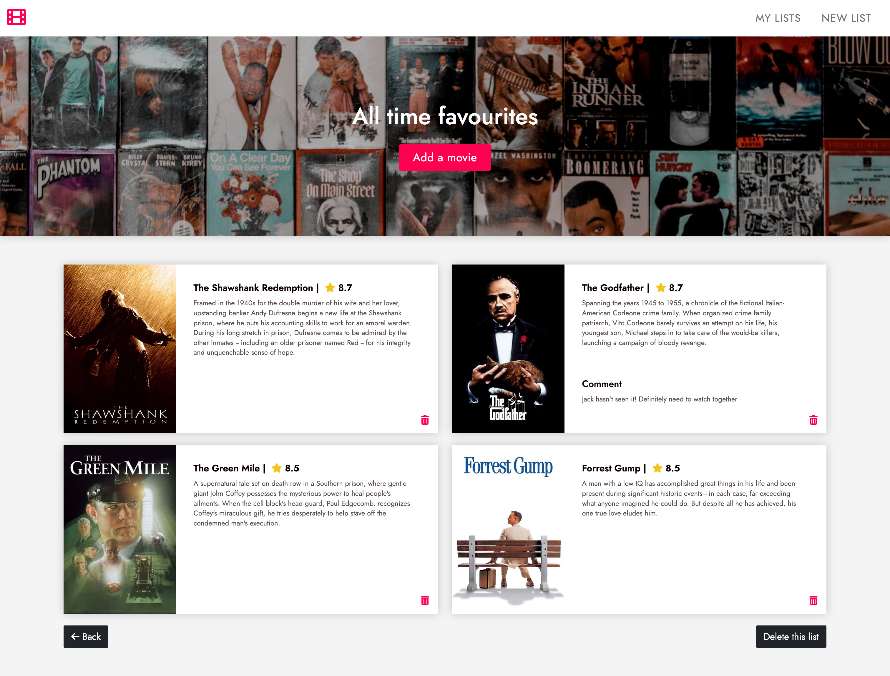

# Movies Watchlist

Movies Watchlist is a Ruby on Rails app which allows you to create custom lists and save movies you would want to watch.

## Overview

### The challenge

Users should be able to:

- See all movie lists previously created
- Create a new movie list
- Delete an existing movie list
- See the movies inside a movie list
- Add a movie to the movie list
- Delete a movie from the movies list

### Screenshot

### Links

- Live Site URL: [Movies Watchlist](https://rails-watch-list-production.up.railway.app/)

## My process

### Built with

- Ruby
- Ruby on Rails 7
- PostgreSQL
- Stimulus JS
- Hotwire Turbo
- API
- HTML
- SASS
- Bootstrap

### Learnings + future focus

The main purpose of this project was to practice basic CRUD actions using Ruby on Rails framework. One of the main challenges was to render forms for creating lists and adding movies in bootstrap modals using Turbo Frames and Stimulus to perform server side validation and re-render the forms with error details to the user.

Possible future steps:
- For demonstration purposes there is no user authentication, so adding authentication with Devise gem could be a logical next step.
- Using a different API with a wider range of movies
- Adding the rest of CRUD actions (edit/update)
- Refactoring to make the code more reusable and DRY

## Author

- Github - [jane-doronina](https://github.com/jane-doronina)
- LinkedIn - [@zhanna-doronina](https://www.linkedin.com/in/zhanna-doronina/)
